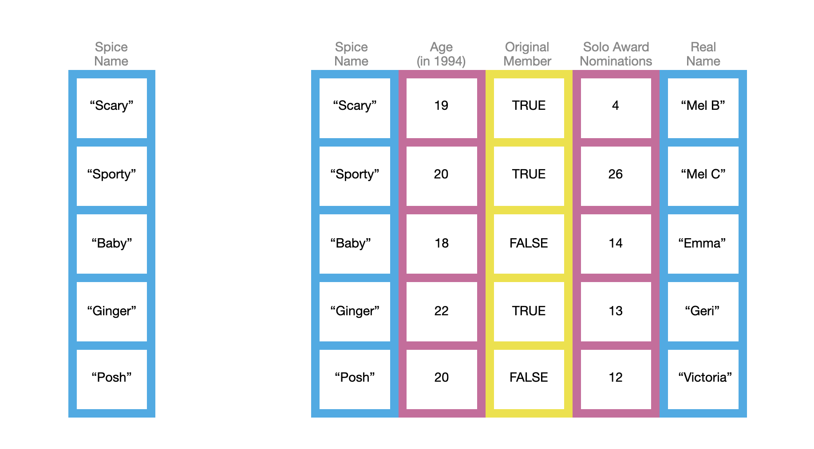

```{r}

```

layout: true
background-image: url(https://www.agec.ntu.edu.tw/uploads/asset/data/675f864c74ccc38a768f8254/%E6%9C%AA%E4%BE%86%E5%B1%95%E6%9C%9B%E5%9C%96%E7%89%87.png)
background-position: 98% 2%
background-size: 5%

```{r setup, include=FALSE}
library(knitr)
library(kableExtra)
library(dplyr)
library(ggplot2)
library(vistributions)
library(gginference)
setwd(dirname(rstudioapi::documentPath()))
options(htmltools.dir.version = FALSE)
knitr::opts_chunk$set(echo = TRUE, tidy = FALSE)
xaringanExtra::use_panelset()
xaringanExtra::use_clipboard()
xaringanExtra::use_extra_styles(hover_code_line = TRUE)
```
```{r xaringanExtra, echo = FALSE}
xaringanExtra::use_progress_bar(color = "#EFBE43", location = "bottom")
```
```{r xaringan-themer, include=FALSE, warning=FALSE}
library(xaringanthemer)
style_duo(
  # colors
  primary_color = "#FDF7E9",
  secondary_color = "#EFBE43",
  header_color = "#333333",
  text_color = "#333333",
  code_inline_color = colorspace::lighten("#333333"),
  text_bold_color = colorspace::lighten("#333333"),
  link_color = "#4466B0",
  title_slide_text_color = "#4466B0",

  # fonts
  header_font_google = google_font("Martel", "300", "400"),
  text_font_google = google_font("Lato"),
  code_font_google = google_font("Fira Mono")
)

style_extra_css(
  # 只針對段落 (p) 和列表 (li) 內的 `code`
  list(
    "p code, li code" = list(  
      "border" = "1px solid #F6DB96",
      "padding" = "2px 4px",
      "border-radius" = "4px"
      ),
    "ul ul" = list(
      "list-style-type" = "'▸'"  # 第二層使用三角形 (▸)
      ),
    "ul ul ul" = list(
      "list-style-type" = "'✔'"  # 第三層使用勾勾 (✔)
      ),
    # 置中
    ".middle_block" = list(
      "position" = "absolute",
      "top" = "50%",
      "left" = "50%", # 使與預設靠左距離相同
      "transform" = "translate(-50%, -50%)",
      "width" = "85%",              # 控制內文寬度（可調整）
      "text-align" = "left"         
      ),
    # 縮排
    ".indent" = list(
      "text-indent" = "2em"
      ),
    # 自動換行
    "pre code" = list(
      "white-space" = "pre-wrap",
      "word-wrap" = "break-word"
      ),
    "pre" = list(
      "border" = "none",
      "box-shadow" = "2px 2px 2px 2px #F7EEDA",
      "padding" = "0.1em",
      "background" = "none !important",
      "overflow-x" = "auto",
      "border-radius" = "1px"
      ),
    # 條列圖示顏色
    "li::marker" = list(
      "content" = "• ",
      "color" =  "#EFBE43"
      )
    )
  )

```


```{r, echo = FALSE}
options(servr.daemon = TRUE)
```

---
## TA

### 徐麗茵
- 學經歷

  - 流行病學與預防醫學研究所 生統組博士班
  
  - 資料科學博士學位學程

- 聯絡方式

  - leyin2030@gmail.com

- 課程負責項目

  - 批改正課作業
  
  - 批改期中期末試題

---
## TA

### 王俊欽（Leo）
- 學經歷

  - 農業經濟學系研究所博士班
  
  - 統計碩士學位學程

- 聯絡方式

  - d14627001@ntu.edu.tw

- 課程負責項目

  - 實習課授課
  
  - 批改實習課作業與考試
  

---
## 實習課評分

實習課成績占學期總成績 20 %

- 出席（5%）
  - <span style="line-height: 2;">每次實習課點名，請假寄信至 d14627001@ntu.edu.tw <span>
  - <span style="line-height: 2;font-weight: 700">前兩次請假、未到不扣分，第三次開始扣 1 % 總成績 <span>
- 實習作業 2 次（5%，共計 100 分）
  - <span style="line-height: 2;">繳交內容：程式碼、報告or結果<span>
  - <span style="line-height: 2;">繳交方式：NTU COOL 線上繳交<span>
  - <span style="line-height: 2;font-weight: 700">作業遲交 24 小時扣 10 分，超過 24 小時不予補交<span>
  
---
## 實習課評分
實習課成績占學期總成績 20 %

- 上機考試（10%）
  - <span style="line-height: 2;">考試日期：10/12、12/7 兩天<span>
  - <span style="line-height: 2;">考試時間：14:20 - 16:00<span>
  - <span style="line-height: 2;">考試地點：博雅 408、409電腦教室<span>
  - <span style="line-height: 2;">考試方式：Open Book，可以攜帶隨身碟，禁止使用網路與電子產品<span>

- 更多細節如：繳交方式，電腦使用方法待考試前會再與大家說明。

---
## 實習課評分

- **填寫期末教學評鑑，期末分數總分加 ?? 分**

- office hour 時間
  - <span style="line-height: 2;">每週一 16:20 - 18:20，地點：待訂<span>
  - <span style="line-height: 2;">如有問題要詢問，請先將問題寄給助教<span>
  
.center[** 歡迎找厲害的同學討論或積極與助教約 office hour，但千萬不要抄襲拜託**]
.center[** 有任何問題請盡早寄信給助教 **]

---
## 實習課學期目標

- 熟練 R 語言程式操作

- 學習更多資料預處理技巧

- 學習資料視覺化

- 計量分析的實際操作

  - <span style="line-height: 2;">簡單迴歸（OLS、Fixed Effect）<span>
  - <span style="line-height: 2;">雙重差分（DID）<span>
  - <span style="line-height: 2;">工具變數（IV）<span>

---
class: center, middle, inverse
### 快速複習一下上學期都學了什麼
#### 過了一個暑假應該已經找不到 Rstudio 了吧...

---
## DATA TYPE
 `str()`、`class()`、`typeof()` 等指令可以用來辨別資料型態或結構。
.panelset[
.panel[.panel-name[String]
字串（String）需使用單引號 ' 或雙引號 " 作區分
```{r}
str("abc")
class("1")
typeof("Time flies when you're having fun.")
```
]
.panel[.panel-name[Nuneric]
```{r}
class(123.123)
typeof(123L)
```
]
.panel[.panel-name[Logic]
```{r}
class(TRUE)
typeof(FALSE)
```
]
.panel[.panel-name[Boolean]

.left-column[
<br/><br/>
不管是直接輸入或是指令中的 arguments，都可以用 `T` 或 `F`取代
<br/><br/><br/><br/>
此外，TRUE 或 FALSE 也分別代表 1 或 0
]
.right-column[
```{r}
T
F
```

```{r}
T + T
```
]
]
]

---
## DATA STRUCTURE
Vector 屬於一維資料，且資料內容必須為相同 **Data Type**。
.panelset[
.panel[.panel-name[Vector]
.left-column[
<br/>
記得使用 `c()` 建立向量！
<br/><br/>
如果字串與數值同時出現，向量將以字串為主
]
.right-column[
```{r}
num <- c(1, 2, 3, 4, 5)
```
```{r}
str <- c("1", 2, 3, 4, 5)
class(str)
```
]
]
.panel[.panel-name[Index]
索引值（index），為資料所在位置，使用 `[所在位置]` 來尋找。
```{r}
num[3]
num[2:4]
str[-1]
```
]
.panel[.panel-name[Named Vector]
已命名的向量可以用 `[名稱]` 來選取特定值。
```{r}
vec <- c(a = 1, b = 2, c = 3, d = 4, e = 5); print(vec)
vec[c("a", "c", "e")] 
```
]
.panel[.panel-name[Boolean Index]
用布林值作為索引時，布林值與向量長度必須相同。
```{r}
vec[c(T, F, T, F, T)]

```
Recall ! 當布林值長度與向量長度不一致時 ... 循環補齊（recycling）
```{r}
vec[c(T, F)]
```
]

]
---
## DATA STRUCTURE
矩陣（matrix）本質與向量一樣，資料須為相同 **Data Type**，但屬於二維資料。
.panelset[
.panel[.panel-name[Matrix]
.pull-left[
```{r eval = FALSE}
m <- matrix(c(9, 6, 3, 7, 4, 1), nrow = 2, ncol = 3)
```

矩陣有兩個維度，分別顯示列（row）與行（column）
```{r eval = FALSE}
dim(m)
```
]
.pull-right[
```{r echo = FALSE}
m <- matrix(c(9, 6, 3, 7, 4, 1), nrow = 2, ncol = 3)
print(m)
```
<br/><br/>
```{r echo = FALSE}
dim(m)
```
]

]
.panel[.panel-name[Index]
二維資料使用 `[列, 行]` 作為索引值尋找資料。
```{r}
m[1, 3]
```
當索引位置為空值時，預設為全部，如 `[1, 空值]`，則選取整個第 `1` 列。
```{r}
m[1, ]
```

]
]
---
## DATA FRAME
Data frame 是剛接觸資料分析時最常會遇到的資料結構，與矩陣皆為二維資料，但 Data frame 內可以存在**不同 Data Type**。
.panelset[
.panel[.panel-name[Look like]
```{r echo = FALSE, out.width="65%", fig.align='center'}

```
]
.panel[.panel-name[In Practice]
```{r}
df <- mpg %>% select(1:5) %>% head() %>% as.data.frame(); df
```
]
.panel[.panel-name[Index]
Data frame 索引值用法大致與矩陣相同，可以用數字或 `變數名稱` 作為索引值。
.pull-left[
```{r eval = F}
df[, 2]
```
<br/>
```{r eval = F}
df[2, "manufacturer"]
```

]
.pull-right[
```{r echo = F}
df[, 2]
```
<br/>
```{r echo = F}
df[2, "manufacturer"]
```
]
]

.panel[.panel-name['$' sign]
Data frame 可以用 $ 符號作為"行"的索引方式。

- 以 `$` 符號選擇 Data frame 其中一行。

- 使用 `$` 符號後直接接上變數名稱，`不需加上 ""`，類似 dplyr 的便利性。

- 輸出格式為向量（Vector）。

```{r}
df$year
```
]
.panel[.panel-name[Note!]
**處理二維資料時，必須注意資料結構的呈現！（回傳的資料結構不一定是你想要的）**
```{r}
df[c(1, 3, 5), "model"]
df[c(1, 3, 5), c("model", "cyl")]
```
]
]

---
## CRUD
資料分析時的四個基礎步驟
.panelset[
.panel[.panel-name[Create]
- 直接呼叫已存在資料如：iris、mpg

- 從外部環境導入資料（實務上肯定是），副檔名通常為：.csv、.xlsx、.json

- 設定好你的工作路徑 `setwd()`，預設為當前 R file 儲存的位置

- 檔案路徑中的反斜線 `\` 須改為正斜線 `/` 或是 `\\`（Windows 系統）。

- `.` 可以取代當前工作路徑（working directory）

- 如果資料與當前 R file 儲存在相同位置（同個資料夾中），可以直接打上檔名即可

```{r eval = F}
read.csv("CASchools.csv")
```
]
.panel[.panel-name[Read]
讀取資料可以透過指令、索引值與邏輯運算子進行簡單操作
```{r}
head(df, n = 3)
df[df$year == 1999 & df$cyl == 4,] # 二維資料記得補上 ","
```
]
.panel[.panel-name[Update]
使用 `append()`、`$`、`索引值` 簡單新增或修改資料
```{r eval = F}
new_model <- c(df$model, "a5")
new_model <- append(df$model, "a5")
```
```{r echo = F}
new_model <- append(df$model, "a5")
new_model
```
```{r eval = F}
new_model[2] <- "a2"
```
```{r echo = F}
new_model[2] <- "a2"
new_model
```
```{r eval = F}
df$county <- "Germany"
```
```{r echo = F}
df$county <- "Germany"
head(df, n = 1)
```
]
.panel[.panel-name[Delete]
使用 `!`、`索引值` 簡單刪除資料
```{r eval = F}
new_model1 <- new_model[-2]
```
```{r echo = F}
new_model1 <- new_model[-2]
new_model1
```
```{r eval = F}
df1 <- df[df$year != 2008,]
```
```{r echo = F}
df1 <- df[df$year != 2008,]
df1
```

]
]

---
## dplyr
dplyr 是使用 R 進行資料分析時的入門學習套件之一，同時結合獨特的 pipe operator（%>%），對於程式閱讀上來說更直觀、且學習時更容易上手。

**使用 dplyr package 中的 commands 時，直接輸入欄位變數名稱，無須加上引號！**
.panelset[
.panel[.panel-name[Select]
`select()` 可以選擇指定欄位，且支援連續選取 `:`。
```{r}
df1 <- df %>% select(manufacturer:year); head(df1, n = 3)
```
]
.panel[.panel-name[Filter]
`filter()` 可以選擇指定列位，搭配邏輯運算子一起使用。
```{r results = 'hide'}
df2 <- df %>% filter(year == 1999 & displ > 2)
```
```{r echo = F}
df2
```
]
.panel[.panel-name[Mutate]
`mutate()` 可以建立新變數，搭配其他指令以達到建立新變數的要求。
```{r results = 'hide'}
df %>% mutate(county = "Germany")
```
```{r echo = F}
df %>% mutate(county = "Germany")
```
]
.panel[.panel-name[Summarize]
`summarize()` 可以進行簡易的敘述性統計。
```{r }
df %>% group_by(year) %>% summarize(count = n(), displ_m = mean(displ))
```

]
]

---
class: center, middle, inverse
### 謝謝
#### 下周見

