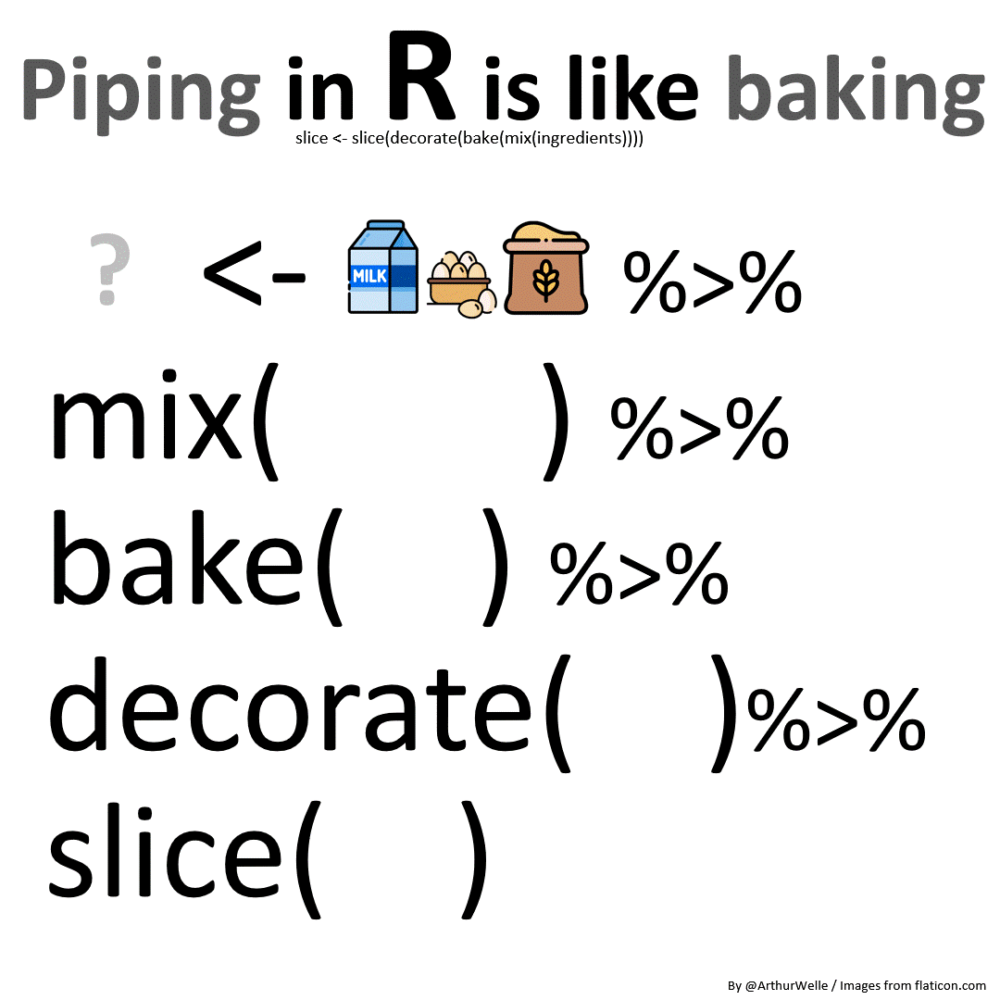
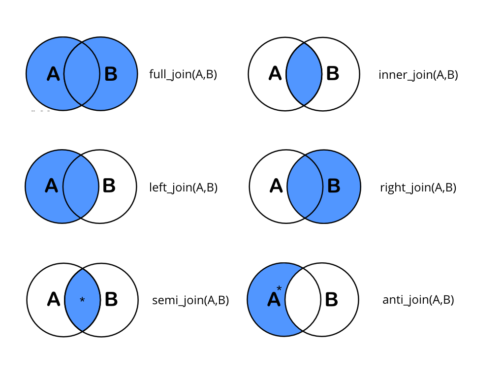
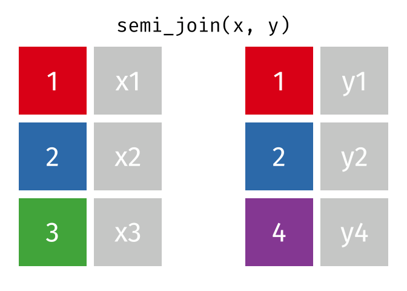

```{r}

```

layout: true
background-image: url(https://www.agec.ntu.edu.tw/uploads/asset/data/675f864c74ccc38a768f8254/%E6%9C%AA%E4%BE%86%E5%B1%95%E6%9C%9B%E5%9C%96%E7%89%87.png)
background-position: 98% 2%
background-size: 5%

```{r setup, include=FALSE}
library(tidyverse)
library(knitr)
library(kableExtra)
library(dplyr)
library(ggplot2)
library(vistributions)
library(gginference)
setwd(dirname(rstudioapi::documentPath()))
options(htmltools.dir.version = FALSE)
knitr::opts_chunk$set(echo = TRUE, tidy = FALSE)
xaringanExtra::use_panelset()
xaringanExtra::use_clipboard()
xaringanExtra::use_extra_styles(hover_code_line = TRUE)
```
```{r xaringanExtra, echo = FALSE}
xaringanExtra::use_progress_bar(color = "#EFBE43", location = "bottom")
```
```{r xaringan-themer, include=FALSE, warning=FALSE}
library(xaringanthemer)
style_duo(
  # colors
  primary_color = "#FDF7E9",
  secondary_color = "#EFBE43",
  header_color = "#333333",
  text_color = "#333333",
  code_inline_color = colorspace::lighten("#333333"),
  text_bold_color = colorspace::lighten("#333333"),
  link_color = "#4466B0",
  title_slide_text_color = "#4466B0",

  # fonts
  header_font_google = google_font("Martel", "300", "400"),
  text_font_google = google_font("Lato"),
  code_font_google = google_font("Fira Mono")
)

style_extra_css(
  # 只針對段落 (p) 和列表 (li) 內的 `code`
  list(
    "p code, li code" = list(  
      "border" = "1px solid #F6DB96",
      "padding" = "2px 4px",
      "border-radius" = "4px"
      ),
    "ul ul" = list(
      "list-style-type" = "'▸'"  # 第二層使用三角形 (▸)
      ),
    "ul ul ul" = list(
      "list-style-type" = "'✔'"  # 第三層使用勾勾 (✔)
      ),
    # 置中
    ".middle_block" = list(
      "position" = "absolute",
      "top" = "50%",
      "left" = "50%", # 使與預設靠左距離相同
      "transform" = "translate(-50%, -50%)",
      "width" = "85%",              # 控制內文寬度（可調整）
      "text-align" = "left"         
      ),
    # 縮排
    ".indent" = list(
      "text-indent" = "2em"
      ),
    # 自動換行
    "pre code" = list(
      "white-space" = "pre-wrap",
      "word-wrap" = "break-word"
      ),
    "pre" = list(
      "border" = "none",
      "box-shadow" = "2px 2px 2px 2px #F7EEDA",
      "padding" = "0.1em",
      "background" = "none !important",
      "overflow-x" = "auto",
      "border-radius" = "1px"
      ),
    # 條列圖示顏色
    "li::marker" = list(
      "content" = "• ",
      "color" =  "#EFBE43"
      )
    )
  )

```


```{r, echo = FALSE}
options(servr.daemon = TRUE)
```

---
## Recall pipeline

- ` %>% ` 是 tidy 家族中常用且使程式碼更易閱讀的運算子

- 使用 pipeline 建立工作流程（workflow）有效建立操作邏輯

```{r eval = F}
library(dplyr) 
```


- 預設是將左方 R object 帶入右方指令的第一個參數

.pull-left[
f(x)
```{r}
sum(c(1:5))
```
]

.pull-right[
x %>% f()
```{r}
c(1:5) %>% sum()
```
]

---
## Recall pipeline
**penguins** 資料集中包含企鵝品種、居住島、喙長寬與體重等等變數。
```{r size= 'huge'}
head(penguins)
```
---
## Recall pipeline
使用 dplyr 指令可以讓工作流程更清晰，例如：統計不同品種、性別間的企鵝嘴喙的長寬比最小值是多少。
.panelset[
.panel[.panel-name[w/o dplyr]

```{r}
summarize(select(group_by(mutate(drop_na(
          penguins), bill_ratio = bill_len/ bill_dep), species, sex), species, sex, bill_ratio), min_bill_ratio = min(bill_ratio), .groups = "keep")

```
]
.panel[.panel-name[w/ dplyr]

```{r}
penguins %>%
  drop_na() %>%
  mutate(bill_ratio = bill_len/ bill_dep) %>% 
  group_by(species, sex) %>%
  select(species, sex, bill_ratio) %>% 
  summarize(min_bill_ratio = min(bill_ratio), .groups = 'keep')

```
]
]
---
## Recall pipeline
```{r echo = FALSE, out.width="55%", fig.align='center'}

```
<p style="text-align: center;">圖片來源：<a href="https://github.com/arthurwelle/VIS/blob/master/Pipe_Cake/Pipe_baking_magrittr_backAssign.gif">Arthur Welle</a></p>

---
## Merge
通常在整理資料的過程中，需要透過結合各個不同類型或是時間段的資料並加以分析，這時就必須將多個資料進行合併。實務上，資料合併大致可分為：

- 垂直合併：通常在合併相同但**時間不同**的資料集，或是合併**不同公司或單位**的財務報表或股價資料，這些資料集通常都會有相同的欄位（column）名稱與數量，整體資料寬度不會改變，例如：將一月至十二月的天氣資料垂直合併。

- 水平合併：通常在合併有關連的資料集，這類資料通常主題或調查製作單位不一樣，兩個資料集的行數或欄位皆可以不盡相同但是必須**具有一個或多個索引鍵（key value）**使兩個資料集有依據的水平合併起來，例如：將國家總經資料與社經資料依照國家名稱水平合併。

---
## Vertically Merge
將具有相同欄位數量與名稱（非必要）的資料以上下疊加的方式垂直合併。
.panelset[
.panel[.panel-name[rbind]
.pull-left[
```{r}
d1 <- tribble(
  ~id, ~name, ~score,
  1, "Chloe", 95,
  2, "Leo"  , 60,
  3, "Sandy", 82
)
d2 <- tibble(
  id = c(4:6),
  name = c("Tim", "Irene", "Cindy"),
  score = id * 10 + 15
)
```
]
.pull-right[
```{r}
rbind(d1, d2)
```
]
]
.panel[.panel-name[difference column]
當資料集中存在不同變數名稱時，未合併到的部分將為 NA。
.pull-left[
```{r}
d3 <- tribble(
  ~id, ~name, ~math,
  1, "Chloe", 95,
  2, "Leo"  , 60,
  3, "Sandy", 82
)
d4 <- tibble(
  id = c(4:6),
  name = c("Tim", "Irene", "Cindy"),
  english = id * 10 + 15
)
```
]
.pull-right[
```{r}
d3 %>% bind_rows(d4)
```
]
]
]

---
## Vertically Merge
如果兩個資料集的變數名稱不同時，需要先將變數名稱修改一致，再進行垂直合併。
.panelset[
.panel[.panel-name[data]
.pull-left[
```{r}
d5 <- tribble(
  ~order, ~name, ~math,
  1, "Chloe", 95,
  2, "Leo"  , 60,
  3, "Sandy", 82
)
```
```{r echo = F}
d5
```
]
.pull-right[
```{r}
d6 <- tibble(
  id = c(4:6),
  name = c("Tim", "Irene", "Cindy"),
  english = id * 10 + 15
)
```
```{r echo = F}
d6
```
]
]
.panel[.panel-name[rename]
```{r}
d5 %>% rename(id = order) %>% bind_rows(d6)
```
]
]

---
## Horizontally Merge
通常在整理資料的過程中，需要結合各個不同類型的資料並加以分析，這時需要依據**索引鍵（key value）**將不同資料水平合併，tidyverse 中有幾種 join 方式大致可分為：
.left-column[

- Full Join

- Left Join

- Right Join

- Inner Join

- Semi Join
]
.right-column[
```{r echo = FALSE, out.width="75%", fig.align='center'}

```
]

---
## Horizontally Merge
有兩個資料集，資料集 people 中包含個人的 id, name 兩個變數；資料集 school 中包含個人 id, school 兩個變數，我們可以藉由索引鍵 **id** 來水平合併兩個資料集。

```{r}
people <- tibble(
  id = c(1, 2, 3, 4, 6),
  name = c("Tim", "Irene", "Cindy", "Chloe", "Sandy")
  
)
school <- tribble(
  ~id, ~school,
  3, "NTU",
  4, "NTNU",
  5, "NCCU",
  7, "NTU"
)
```


---
## Horizontally Merge
依據一或多個索引鍵（key value）對兩個或以上的資料集進行水平合併， `by` argument 可以提供實際要使用的索引鍵，沒設定的話會自動依據被合併的資料集做選擇。
.panelset[
.panel[.panel-name[Full]
```{r}
people %>% full_join(school, by = "id")
```
]
.panel[.panel-name[Left]
以左表 people 為主表，將右表 school 向左水平合併。
```{r}
people %>% left_join(school, by = "id")
```
]
.panel[.panel-name[Right]
以右表 school 為主表，將左表 people 向右水平合併。
```{r}
people %>% right_join(school, by = "id")
```
]
.panel[.panel-name[Inner]
沒設定 by 什麼索引鍵的話，則自動依據被合併的資料集做選擇。
```{r}
people %>% inner_join(school)
```
]
]

---
## Horizontally Merge

`semi_join()` 與 `inner_join()` 差別在於 `semi_join()` 不會保留右表資料。
.pull-left[
```{r echo = FALSE, out.width="100%", fig.align='center'}

```
]
.pull-right[
```{r echo = FALSE, out.width="100%", fig.align='center'}
knitr::include_graphics("./inner-join.gif")
```
]
<p style="text-align: center;">圖片來源：<a href="https://github.com/gadenbuie/tidyexplain">Garrick Aden-Buie tidyexplain</a></p>
---
## Horizontally Merge

`semi_join(x, y)` 是當遇到一種情況：舉行交換學生行前說明會之前，想從學生名單中挑出**有錄取的交換學生**寄通知信。此時我只需要用錄取名單中的 `id` 來篩選左表，而不需要學校、國家、學期等欄位資訊。
```{r}
people <- tibble(
  id    = c(1, 2, 3, 4, 6),
  name  = c("Tim", "Irene", "Cindy", "Chloe", "Sandy"),
  score = c(88, 76, 95, 60, 82)
)

exchange <- tribble(      
  ~id, ~school, ~country,  ~semester,
  1,   "NTU",   "Japan",   "2025 Fall",
  3,   "NTNU",  "Germany", "2025 Fall",
  6,   "NCCU",  "American",   "2026 Spring",
  7,   "NTU",   "American",  "2026 Spring"
)
```

---
## Horizontally Merge
.panelset[
.panel[.panel-name[Semi]
從左表 people 中篩選出 id 也在右表 exchange 的資料，篩選完後只保留左表資料。
```{r}
people %>% semi_join(exchange, by = "id")
```
]
.panel[.panel-name[Anti]
從左表 people 中篩選出 id 不在右表 exchange 的資料，篩選完後只保留左表資料。
```{r}
people %>% anti_join(exchange, by = "id")
```
]
]

---
## Horizontally Merge
如果兩個資料集的索引鍵（key value）名稱不同時，在 `by` argument 中手動指定左右表的索引鍵，寫法為 `by = c("左表索引鍵" = "右表索引鍵")`。
```{r}
people <- tibble(
  ID = c(1, 2, 3, 4, 6),
  name = c("Tim", "Irene", "Cindy", "Chloe", "Sandy"))
school <- tribble(
  ~id, ~school,
  3, "NTU",
  4, "NTNU",
  5, "NCCU",
  7, "NTU")

people %>% inner_join(school, by = c("ID" = "id"))
```

---
## Horizontally Merge
有時候單一索引鍵無法唯一辨別一筆資料。例如 `score` 記錄學生**每一年**的學期成績，`grant` 記錄每個學生**每一年**領到的獎學金金額——同一個 id 在兩張表中都出現多次，此時需同時使用 id, year 作為索引鍵才能辨別唯一資料。

```{r}
score <- tribble(
  ~id, ~year, ~name,   ~score,
  1,   2024,  "Tim",   88,
  1,   2025,  "Tim",   91,
  2,   2024,  "Irene", 76,
  2,   2025,  "Irene", 82,
  3,   2024,  "Cindy", 95
)
grant <- tribble(
  ~id, ~year, ~scholarship,
  1,   2024,  8000,
  1,   2025,  12000,
  2,   2024,  5000,
  3,   2025,  10000
)
```

---
## Horizontally Merge
.panelset[
.panel[.panel-name[only key: id]
```{r warning = TRUE}
score %>% left_join(grant, by = "id")
```
]
.panel[.panel-name[both of keys]
將 id, year 一起放進 `by`，**兩個條件同時符合**才算配對成功，資料維持 5 筆。
```{r}
score %>% left_join(grant, by = c("id", "year"))
```
沒領獎學金的學生年度（Irene 2025、Cindy 2024）`amount` 為 `NA`。
]

.panel[.panel-name[one difference key name]
一個索引鍵名稱相同、另一個不同，可以**混合寫法**。
```{r}
grant2 <- grant %>% rename(yr = year)
score %>% left_join(grant2, by = c("id", "year" = "yr"))
```
]
]

---
## Horizontally Merge
前面的範例中 `id` 都是唯一值，所以合併前後筆數不變；但只要有**一邊的索引鍵重複，合併後的資料筆數就會增加**。

```{r}
people <- tibble(
  id    = c(1, 2, 3, 4, 6),
  name  = c("Tim", "Irene", "Cindy", "Chloe", "Sandy"),
  score = c(88, 76, 95, 60, 82)
)
club <- tribble(    # 一個人可以參加多個社團
  ~id, ~club,
  1,   "Basketball",
  1,   "Photography",
  2,   "Guitar",
  3,   "Basketball",
  3,   "Debate",
  3,   "Volleyball"
)
```

---
## Horizontally Merge 

`people` 原本 5 筆（一人一筆），合併後變成 8 筆：Cindy 參加 3 個社團，會複製成 3 列。
```{r}
people %>% left_join(club, by = "id")
```


---
class: center, middle, inverse
### 謝謝
#### 下周見